<!-- START doctoc generated TOC please keep comment here to allow auto update -->
<!-- DON'T EDIT THIS SECTION, INSTEAD RE-RUN doctoc TO UPDATE -->

- [Wallot](#wallot)
  - [Testing the APIs:](#testing-the-apis)
    - [REST API](#rest-api)
  - [Architecture:](#architecture)
  - [User Experience:](#user-experience)
  - [Key Terms:](#key-terms)

<!-- END doctoc generated TOC please keep comment here to allow auto update -->

# Wallot

## Testing the APIs:

### REST API

```
bash expressjs-servers/rest-api/smoke-tests/test-health-endpoints.sh test local
bash expressjs-servers/rest-api/smoke-tests/test-health-endpoints.sh test cloud-functions
bash expressjs-servers/rest-api/smoke-tests/test-health-endpoints.sh test primary
```

## Architecture:

```mermaid
erDiagram

	USER ||--|| FUNDING_ACCOUNT : "has_one"
	USER ||--|| STRIPE_CUSTOMER : "linked_to"
	USER ||--|{ AUTH_CREDENTIAL : "has_many"
	USER ||--|{ ORDER : "places"
	USER ||--|{ POSITION : "holds"
	USER ||--|{ PAYMENT_METHOD : "has"
	USER ||--|{ TRANSACTION : "makes"
	USER ||--|{ INVOICE : "receives"
	USER ||--|| LICENSE : "has_one"
	USER ||--|| ALPACA_ACCOUNT : "has_one"
	USER {
		string _id PK
		string given_name
		string email
		datetime created_at
		string status
	}

	AUTH_CREDENTIAL {
		string _id PK
		string user_id FK
		string provider
		string access_token
		datetime created_at
	}

	FUNDING_ACCOUNT ||--|| STRIPE_FINANCIAL_CONNECTION_ACCOUNT : "linked_from"
	FUNDING_ACCOUNT ||--|| ALPACA_ACH_RELATIONSHIP : "mapped_to"
	FUNDING_ACCOUNT {
		string _id PK
		string user_id FK
		string nickname
		string status
		datetime created_at
	}

	MODEL ||--|{ FORECAST : "produces"
	MODEL ||--|{ RECOMMENDATION : "generates"
	MODEL {
		string _id PK
		string user_id FK
		string name
		string model_type
		datetime created_at
	}

	FORECAST ||--|| STOCK : "for"
	FORECAST {
		string _id PK
		string model_id FK
		string stock_id FK
		date forecast_date
		double predicted_price
	}

	RECOMMENDATION ||--|| STOCK : "about"
	RECOMMENDATION {
		string _id PK
		string model_id FK
		string stock_id FK
		string recommendation_type
		datetime created_at
	}

	STOCK ||--|| ALPHA_VANTAGE_COMPANY : "info_from"
	STOCK {
		string _id PK
		string symbol
		string name
		string exchange
		string sector
	}

	ORDER ||--|| STOCK : "targets"
	ORDER ||--|| ALPACA_ORDER : "mirrors"
	ORDER {
		string _id PK
		string user_id FK
		string stock_id FK
		string order_type
		double quantity
		double price
	}

	POSITION ||--|| STOCK : "represents"
	POSITION ||--|| ALPACA_POSITION : "mirrors"
	POSITION {
		string _id PK
		string user_id FK
		string stock_id FK
		double quantity
		double average_cost
	}

	PAYMENT_METHOD ||--|| STRIPE_PAYMENT_METHOD : "backed_by"
	PAYMENT_METHOD {
		string _id PK
		string user_id FK
		string type
		string status
		datetime created_at
	}

	TRANSACTION {
		string _id PK
		string user_id FK
		string type
		double amount
		datetime created_at
	}

	INVOICE ||--|| STRIPE_INVOICE : "backed_by"
	INVOICE {
		string _id PK
		string user_id FK
		double amount_due
		datetime created_at
		string status
	}

	LICENSE ||--|| STRIPE_SUBSCRIPTION : "reflected_by"
	LICENSE {
		string _id PK
		string user_id FK
		string status
		datetime valid_until
	}

	STRIPE_CUSTOMER ||--|{ STRIPE_FINANCIAL_CONNECTION_SESSION : "initiates"
	STRIPE_CUSTOMER ||--|{ STRIPE_PAYMENT_METHOD : "owns"
	STRIPE_CUSTOMER ||--|{ STRIPE_SUBSCRIPTION : "subscribes_to"
	STRIPE_CUSTOMER ||--|{ STRIPE_INVOICE : "receives"
	STRIPE_CUSTOMER {
		string _id PK
		string user_id FK
		string email
		string stripe_id
		datetime created_at
	}

	STRIPE_FINANCIAL_CONNECTION_SESSION ||--|{ STRIPE_FINANCIAL_CONNECTION_ACCOUNT : "yields"
	STRIPE_FINANCIAL_CONNECTION_SESSION {
		string _id PK
		string stripe_customer_id FK
		datetime created_at
		string client_secret
	}

	STRIPE_FINANCIAL_CONNECTION_ACCOUNT {
		string _id PK
		string bank_name
		string last4
		string routing_number
		datetime created_at
	}

	STRIPE_INVOICE {
		string _id PK
		string stripe_customer_id FK
		double amount_due
		string status
		datetime created_at
	}

	STRIPE_PAYMENT_METHOD {
		string _id PK
		string stripe_customer_id FK
		string type
		string last4
		datetime created_at
	}

	STRIPE_SUBSCRIPTION {
		string _id PK
		string stripe_customer_id FK
		string status
		datetime current_period_end
	}

	ALPACA_ACCOUNT ||--|{ ALPACA_ACH_RELATIONSHIP : "has"
	ALPACA_ACCOUNT ||--|{ ALPACA_ACH_TRANSFER : "performs"
	ALPACA_ACCOUNT ||--|{ ALPACA_ORDER : "submits"
	ALPACA_ACCOUNT ||--|{ ALPACA_POSITION : "holds"
	ALPACA_ACCOUNT {
		string _id PK
		string user_id FK
		string status
		double cash_balance
		datetime created_at
	}

	ALPACA_ACH_RELATIONSHIP {
		string _id PK
		string alpaca_account_id FK
		string bank_name
		string account_number_last4
		datetime created_at
	}

	ALPACA_ACH_TRANSFER {
		string _id PK
		string alpaca_account_id FK
		double amount
		string direction
		datetime created_at
	}

	ALPACA_ASSET ||--|| STOCK : "corresponds_to"
	ALPACA_ASSET {
		string _id PK
		string symbol
		string name
		string exchange
	}

	ALPACA_ORDER ||--|| ORDER : "mirrors"
	ALPACA_ORDER {
		string _id PK
		string alpaca_account_id FK
		string alpaca_asset_id FK
		string side
		double qty
	}

	ALPACA_POSITION ||--|| POSITION : "mirrors"
	ALPACA_POSITION {
		string _id PK
		string alpaca_account_id FK
		string alpaca_asset_id FK
		double qty
		double avg_entry_price
	}

	ALPHA_VANTAGE_COMPANY ||--|| STOCK : "describes"
	ALPHA_VANTAGE_COMPANY {
		string _id PK
		string stock_id FK
		string name
		string industry
		string description
	}
```



## User Experience:


> @kamarmack - replace this placeholder image with a screenshot of the user experience

## Key Terms:

> @kamarmack - add a list of key terms and the explanations for each terms
